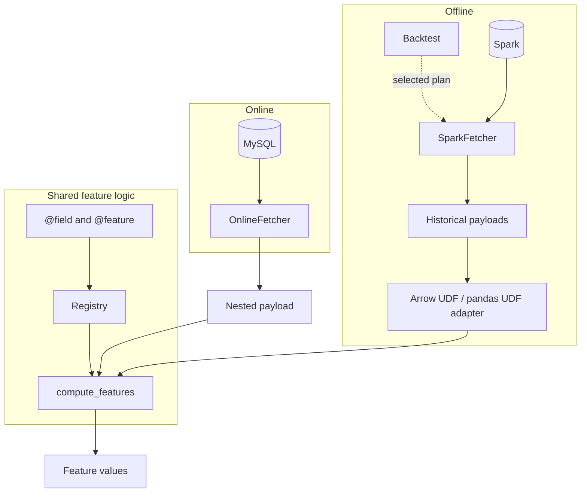

# mirus

An open-source feature computation and payload retrieval library for fintech projects. Write Python feature logic once, with lightweight online execution and shared historical payload contracts.

This repository is a design-stage library. Online computation, Spark historical retrieval, and distributed feature execution via Arrow UDF / pandas UDF are implemented. Licensed under the [MIT License](LICENSE).

## Online and offline

| | Online | Offline |
| --- | --- | --- |
| Engine | Python | Spark |
| Storage | MySQL | Hive |

`compute_features` runs Python functions on a nested payload. `OnlineFetcher` loads that payload from MySQL. `Backtest` retrieves selected historical sources through `SparkFetcher` and executes the same functions on workers.

## Usage

Tag a function, then import its module. Importing registers the function, the same way importing a test module collects a pytest test. mirus does not scan the filesystem.

```python
from mirus.features.decorators import feature, field
from mirus.features.compute import compute_features

@field(source="loans")
def dollar_amount(row) -> float:
    return float(row["principal"]) / 7

@feature(source="loans")
def loan_count(rows) -> int:
    return len(rows)

payload = {"loans": [{"principal": 700}, {"principal": 1400}]}
compute_features(payload, ["loan_count"])
# {"loan_count": 2}
```

`@field` runs once per source record. Nested objects and lists stay nested: two payments never turn one loan into two loan rows. Root scalar values are merged into each row, with source keys taking precedence. Fields can return a scalar or a transformed list; fields read raw values independently, and selected features share the prepared rows. Treat nested values and prepared rows as read-only.

`@feature` aggregates those rows and returns one value. Pass feature names to compute a subset, or omit them to compute every registered feature. Result keys preserve the requested order.

One function can also define a family. Select the concrete name, such as `loan_shopping_amount`:

```python
@feature(
    source="loans",
    feature_name="loan_{purpose}_amount",
    parameters={"purpose": ["shopping", "medical"]},
)
def loan_amount(rows, *, purpose) -> float:
    return sum(row["amount"] for row in rows if row["purpose"] == purpose)
```

See [examples/loan_features.py](examples/loan_features.py) and [examples/README.md](examples/README.md).

### Optional startup preparation

The simple API prepares selected definitions and source groups per request. Services can optionally prepare a reusable catalog, without computing values:

```python
from mirus.features.compute import compute_features, prepare_features

catalog = prepare_features(["loan_count"])
result = compute_features(payload, catalog=catalog)
```

A supplied catalog defines the selection and executes its prepared groups directly. If both `feature_names` and `catalog` are supplied, `feature_names` is ignored. To compute a different selection, prepare another catalog or call `compute_features(payload, names)` without one. Catalogs are optional and no selections are cached.

### Historical retrieval contract

Root primary keys together with observation time must identify one driver observation. A user can appear at multiple timestamps; each observation is joined independently. Use an observation ID when multiple requests share the same user and timestamp.

Set `mutable` on each payload section; it defaults to `false`.

Use table addresses directly: `db: lending.loan_record` and
`dwh: lending_history.loan_record`; no nested `table` key is required.

- `mutable: false`: `dwh` contains immutable records. PIT retrieval keeps
  records whose availability timestamp is at or before the observation, without
  building a version window.
- `mutable: true`: `dwh` must be a historical snapshot table containing
  complete row versions, including initial and latest versions within its supported
  historical period. It is not today's mutable state or a raw CDC log.

Online retrieval still reads current records from `db`. Historical rows use
the same logical field schema through the existing YAML field mapping. No separate
mutation-table key, interval columns, or CDC metadata are required. Mark the version
availability timestamp with `available_at: true`; an unchanged business `createdat`
must not be used to date updates.

For each observation, retrieval selects the latest available version per complete
primary key. Version intervals are derived before relationship matching, including
when a record changes owner. Primary key plus availability timestamp must identify
one version; equal-time conflicting versions have no defined order. There are no
required `_operation`, `_sequence`, or `_available_at` columns. Hard-delete history
is not supported by this contract; omitting a row does not represent a deletion.
DB/DWH types and UTC timestamp conventions must match.

### Distributed feature computation

```python
import examples.loan_features  # Import your feature definitions before computing.
from mirus.backtest import Backtest
from mirus.backtest.spark.config import configure_spark

configure_spark(spark, batch_rows=256)  # Explicit UTC and Arrow batch settings.
backtest = Backtest(
    payload_yaml="examples/credit_application.yaml",
    backend="spark.pandas",  # Or "spark" for the Arrow scalar UDF; default is spark.
)
result = backtest.compute(
    driver,
    feature_names=["loan_count", "loan_total_amount_usd"],
)
# Lazy DataFrame: observation keys/time plus the selected feature columns.
```

`Backtest` loads the YAML once at construction. Each compute call prepares its
selection on the driver without caching. Both backends skip unused top-level sources and execute
one UDF returning all selected features. Fields and nested children within selected
sources are retained; there is no field-level dependency inference. Feature functions
stay pure Python, even in the pandas path—batching does not vectorize their loops.

The Arrow UDF uses `asDict(recursive=True)`. The pandas UDF normalizes nested
arrays to lists and pandas timestamps to Python datetimes, without inspecting or
rewriting the input schema. For offline computation, identifiers must arrive as
strings before entering Spark. Exact integer inputs and results must stay within
`-2**53` to `2**53`; larger integers can lose precision during nullable
Spark/Arrow/pandas conversion. This is a data contract, not a runtime validation
or automatic ID conversion.

Return annotations map `int`, `float`, `bool`, `str`, `bytes`, `date`, `datetime`, and
their optional forms to nullable Spark columns. Python integers use Spark `long`.
`feature_names=None` computes all imported features; `[]` selects none and returns
observation columns only. Feature names must not collide with observation column
names. Workers need the same feature modules, dependencies and mirus packages
installed. Configure Spark and the
online data source to use matching UTC conventions; request timestamps are Python
`datetime` values, not automatically formatted strings.

For retrieval alone, use `SparkFetcher(payload, spark).fetch(driver)` from
`mirus.backtest.spark.fetcher`. To score those payloads directly, use
`score_payloads(frame, compile_offline(names), method="pandas")` from
`mirus.backtest.spark.udf`. The input `payload` column must contain non-null structs.

Compare both paths locally with:

```sh
python -m benchmarks.benchmark_spark_udf --features 300 500 --records 20 200
```

The benchmark uses a 12,000-feature pool and identical cached nested payloads. It
forces every selected output to be evaluated and checks result parity. Timings are
complete scoring jobs, including conversion and serialization; they exclude PIT
retrieval and are not online request latency.

### Project validation (development / CI)

Install the optional validation package, then import your feature modules before validating:

```python
import examples.loan_features  # Registers this project's fields and features.
from mirus.validation import validate_project

definition = validate_project("examples/credit_application.yaml")
```

Validation checks the payload contract, duplicate fields and feature names, callable signatures, parameter templates, return annotations, and source compatibility. Feature sources must name top-level payload sections; their records can contain nested objects and lists. Every imported declaration is checked, not just a model's selected features. User functions are never executed and backend schemas are not queried.

Validate the same code and YAML release that you deploy. `prepare_features()` builds metadata without rerunning these checks; online computation does not import validation. Return annotations are required for project validation and offline metadata, but do not enforce runtime values. Request-data validation is separate and is not implemented here. There is no CLI yet.

`Payload.validate()` is replaced by `mirus.validation.validate_payload(payload)` for contract-only validation. `validate_project()` also checks feature definitions and returns the parsed `Payload`; it does not initialize a serving process.

## Layout

```text
mirus/
├── features/    # @field, @feature, compute_features
├── payload/     # shared YAML payload contract
├── serving/     # OnlineFetcher, MySQL
├── backtest/    # Backtest, Spark; separate mirus-backtest package
└── validation/  # Definition checks; separate mirus-validation package
examples/
tests/
```

| Import | From |
| --- | --- |
| `feature`, `field` | `mirus.features.decorators` |
| `compute_features` | `mirus.features.compute` |
| `Payload` | `mirus.payload` |
| `OnlineFetcher`, `MySQLConnection` | `mirus.serving` |
| `Backtest`, `compile_offline` | `mirus.backtest` |
| `SparkFetcher` | `mirus.backtest.spark.fetcher` |
| `validate_project` | `mirus.validation` |

## Install

Python 3.10 or newer, from this repository:

```sh
python -m pip install -e .
python -m pip install -e '.[mysql]'
python -m pip install -e './mirus/backtest[spark]'
python -m pip install -e ./mirus/validation
```

`mirus` includes feature computation, the payload contract, and online serving. The MySQL extra adds PyMySQL. `mirus-backtest` is the offline package; its Spark extra adds PySpark, pandas and PyArrow (plus setuptools for Spark 3.5 on Python 3.12+). Online serving does not install these dependencies.
`mirus-validation` contains development/CI checks and is not included in the serving wheel.

## Architecture


