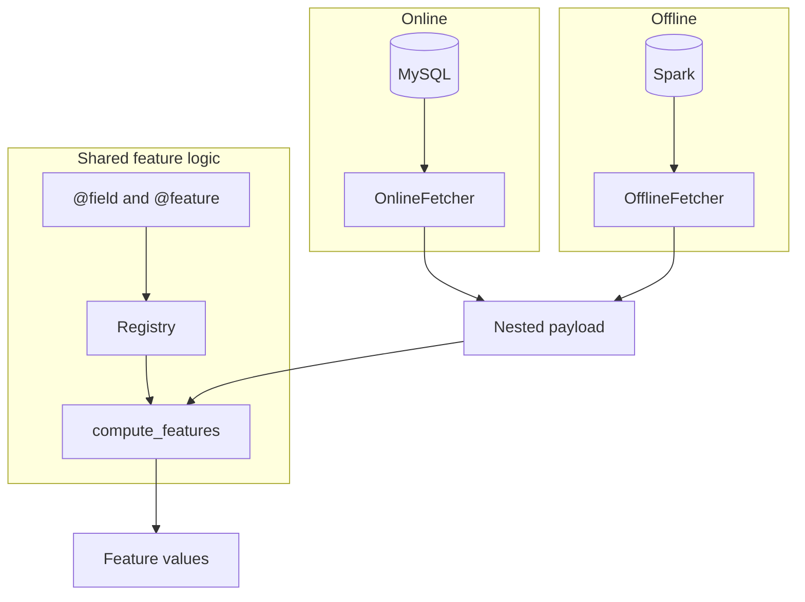

# mirus

An easy-to-use data platform designed for fintech companies. Write feature logic once and seamlessly run it across both distributed engines and real-time inference with millisecond-level latency.

The same Python functions serve a live request and an offline job. This repository is a design-stage library. Licensed under the [MIT License](LICENSE).

## Online and offline

| | Online | Offline |
| --- | --- | --- |
| Engine | Python | Spark |
| Storage | MySQL | Hive |

`compute_features` runs the functions on a nested payload. `OnlineFetcher` loads that payload from MySQL. `OfflineFetcher` builds it in Spark. Python computes the feature values in both cases.

## Usage

Tag a function, then import its module. Importing registers the function, the same way importing a test module collects a pytest test. mirus does not scan the filesystem.

```python
from mirus.features.decorators import feature, field
from mirus.features.compute import compute_features

@field(source="loans")
def dollar_amount(row) -> float:
    return float(row["principal"]) / 7

@feature(source="loans")
def loan_count(rows) -> int:
    return len(rows)

payload = {"loans": [{"principal": 700}, {"principal": 1400}]}
compute_features(payload, ["loan_count"])
# {"loan_count": 2}
```

`@field` runs once per row. `@feature` aggregates those rows and returns one value. Pass feature names to compute a subset, or omit them to compute every registered feature.

One function can also define a family. Select the concrete name, such as `loan_shopping_amount`:

```python
@feature(
    source="loans",
    feature_name="loan_{purpose}_amount",
    parameters={"purpose": ["shopping", "medical"]},
)
def loan_amount(rows, *, purpose) -> float:
    return sum(row["amount"] for row in rows if row["purpose"] == purpose)
```

See [examples/loan_features.py](examples/loan_features.py) and [examples/README.md](examples/README.md).

## Layout

```text
mirus/
├── features/    # @field, @feature, compute_features
├── payload/     # shared YAML payload contract
├── serving/     # OnlineFetcher, MySQL
└── backtest/    # OfflineFetcher, Spark; separate mirus-backtest package
examples/
tests/
```

| Import | From |
| --- | --- |
| `feature`, `field` | `mirus.features.decorators` |
| `compute_features` | `mirus.features.compute` |
| `Payload` | `mirus.payload` |
| `OnlineFetcher`, `MySQLConnection` | `mirus.serving` |
| `OfflineFetcher`, `compile_offline` | `mirus.backtest` |

## Install

Python 3.10 or newer, from this repository:

```sh
python -m pip install -e .
python -m pip install -e '.[mysql]'
python -m pip install -e './mirus/backtest[spark]'
```

`mirus` includes feature computation, the payload contract, and online serving. The MySQL extra adds PyMySQL. `mirus-backtest` is the offline package; its Spark extra adds PySpark.

## Architecture


